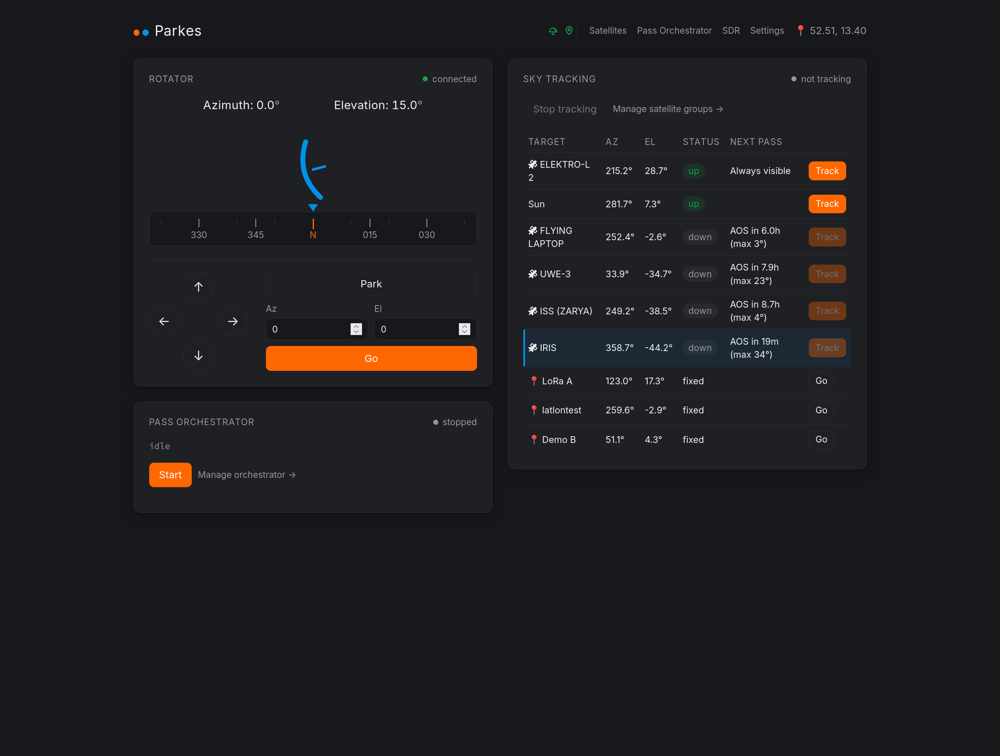
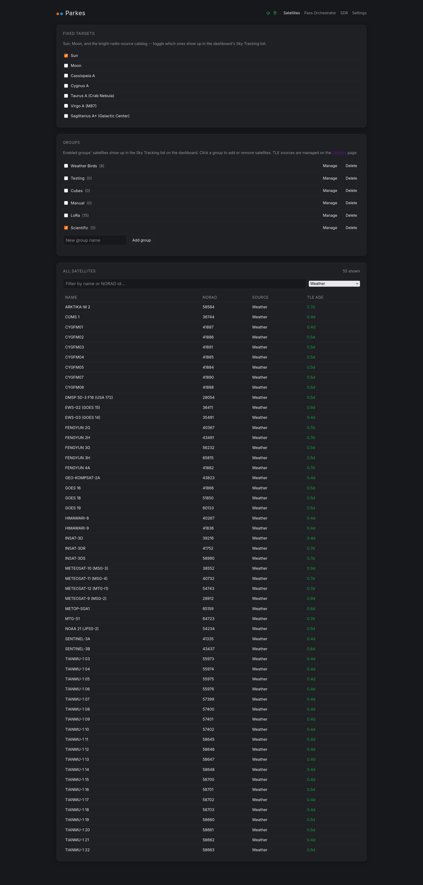
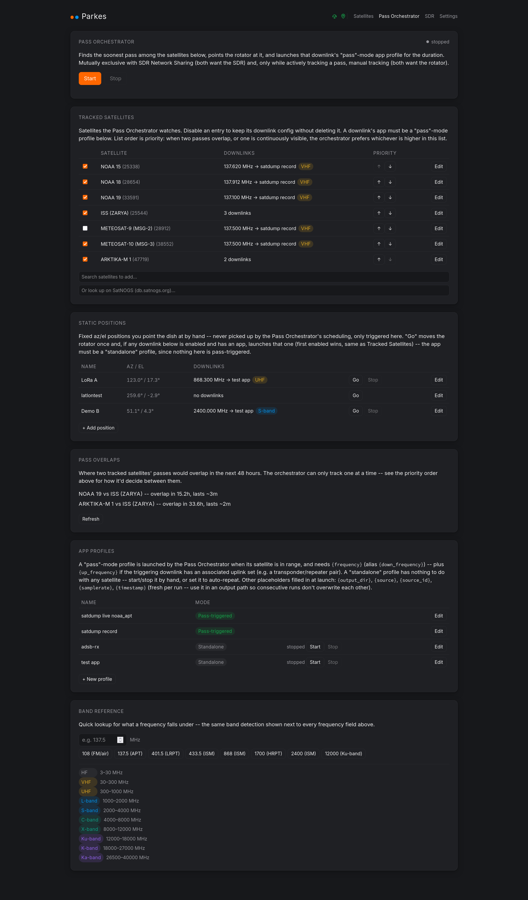
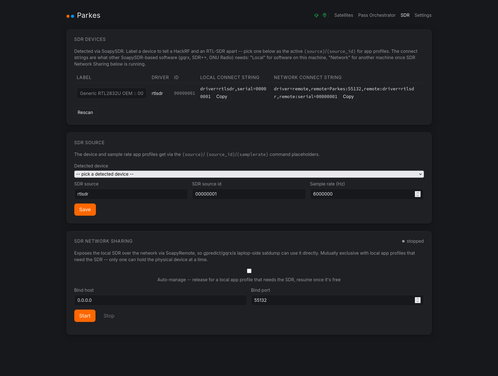
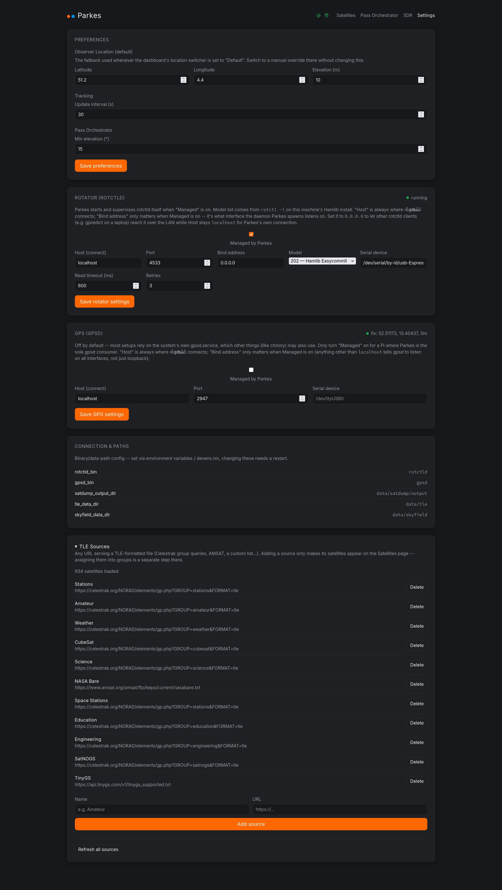

# Parkes

**Turn a Raspberry Pi and a motorized dish into a fully automated satellite ground station.**

Parkes ties together rotator control, orbital tracking, SDR management, and satellite pass decoding into a single web dashboard — no soldering required. It uses existing open source tools (Hamlib, skyfield, satdump, SoapySDR) so you don't have to reimplement any of them.

## What it does

- **Point your dish anywhere.** Parkes drives any `rotctld` compatible rotator, with automatic crash-restart and live reconfiguration — no restart needed.
- **Track anything in the sky.** Computes az/el for satellites (from TLEs) and fixed sources (Sun, Moon, Cas A) using skyfield. Follows passes in real time.
- **Decode satellite passes automatically.** Launches satdump (or any other command) as an orchestrated app for the duration of a pass, with pass prediction and scheduling built in.
- **Use whatever SDR you have.** Exposes SoapySDR devices to satdump, or shares them over SoapyRemote to a remote laptop running gpredict/gqrx.
- **Live GPS location.** Feeds gpsd for real-time lat/lon/elevation, or use fixed coordinates.


## Hardware

Any computer or Raspberry Pi + any rotctld compatible rotator controller + an SDR dongle (RTL-SDR, HackRF, etc.) + a motorized dish mount. Optional: USB GPS dongle.

## Install
See [docs/deploy.md](docs/deploy.md).

## Docker

```bash
docker compose up --build
```

## Screenshots






